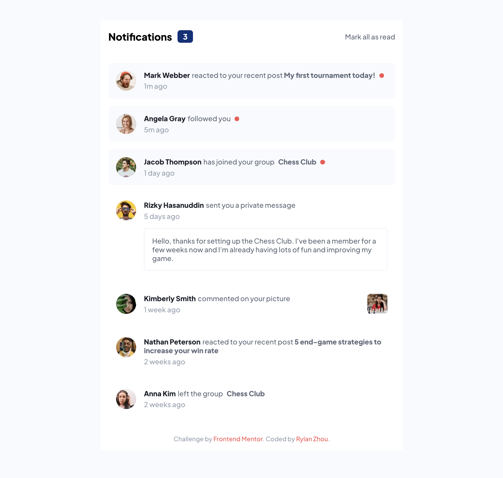
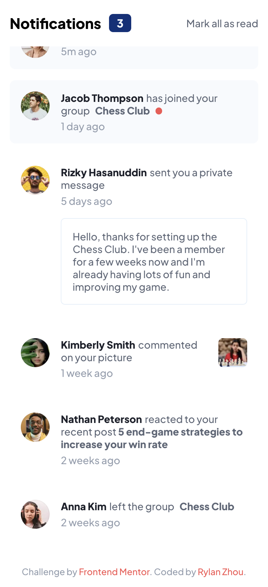

# Frontend Mentor - Notifications page solution

This is a solution to the [Notifications page challenge on Frontend Mentor](https://www.frontendmentor.io/challenges/notifications-page-DqK5QAmKbC). Frontend Mentor challenges help you improve your coding skills by building realistic projects.

## Table of contents

- [Overview](#overview)
  - [The challenge](#the-challenge)
  - [Screenshot](#screenshot)
  - [Links](#links)
- [My process](#my-process)
  - [Built with](#built-with)
  - [What I implemented](#what-i-implemented)

## Overview

### The challenge

Users should be able to:

- [x] Distinguish between "unread" and "read" notifications
- [x] Select "Mark all as read" to toggle the visual state of the unread notifications and set the number of unread messages to zero
- [x] View the optimal layout for the interface depending on their device's screen size
- [x] See hover and focus states for all interactive elements on the page

### Screenshot

|        Desktop        |            Mobile            |
| :-------------------: | :--------------------------: |
|  |  |

### Links

- Solution URL: [Github](https://github.com/RylanZhou/frontend-mentor-notifications-page)
- Live Site URL: [Vercel](https://frontend-mentor-notifications-page-chi.vercel.app/)

## My process

### Built with

- Semantic HTML5 markup
- CSS custom properties
- Scss
- Flexbox
- Mobile-first workflow
- [React](https://reactjs.org/) - JS library
- TypeScript

### What I implemented

1. Dynamically load data and update read/unread effect.

2. Fixed header so that it stays at the top of the screen.

3. App stays in the center on wide desktop devices and stretch to fit the screen on narrower mobile devices.
